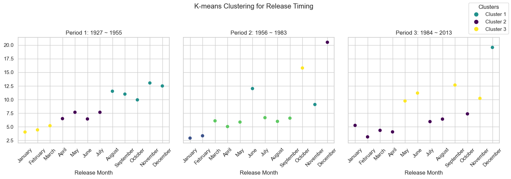
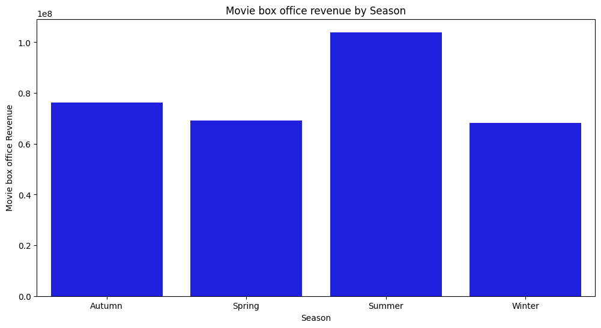

Sometimes, despite having all the pieces in place and doing everything right, success seems elusive. It's often a game of patience. Hard work is undoubtedly a significant factor in achieving success, but there's another crucial element at play – timing. It's about being in the right place at the right moment, seizing opportunities as they arise, and connecting with others at just the right time.

Movies reflect this aspect of life brilliantly. The impact of a film on us depends not just on its content, but also on when we watch it. The right movie at the right time can make us laugh, cry, or reflect. It's a personal experience, unique to each viewer.

But let's zoom out from the individual experience to the broader perspective of the movie industry. Have you ever considered how the timing of a movie release might be a key to its success? In our story, 'Is Timing Everything?', we delve into the CBU movie dataset to explore this fascinating aspect. We'll look at how the release dates of movies influence their success and reception. So, whether you're a film lover, a data geek, or just someone intrigued by the behind-the-scenes of the movie world, join us. We'll dive into patterns, make predictions, and maybe even unearth some insights useful for filmmakers and the movie industry. Life is often about luck, but what if you could sway it in your favor? What if you knew exactly how to time the release of your masterpiece? Ready to make yourself lucky? Let's begin: Action!

_______________________________________________________________

# Release Dates and Movie Genres - Orchestrating the Perfect Season (Question 1)

Let's dive into the intriguing interplay between movie genres and their release calendars. Are horror films naturally drawn to Halloween? Do summer months exclusively belong to action-packed blockbusters? In this part of our story, we'll try to see if there are any recurring patterns between a film's genre and its release timing within a year. Do these rhythms exist, and if so, do they change depending on where the movie is released? This exploration isn't just about identifying patterns; it's about understanding whether these insights can help us predict the genre of upcoming film releases in different seasons. It's time to discover if there's a secret rhythm dictating when different genres of movies make their grand entrance on the big screen.

## 1.1 Exploration

For this analysis, we will focus on the film genres, the release period of the year, and the locations where they are released.
We will also investigate patterns that may exist between the time of year and the number of film releases.

### 1.1.2. Annual periodicity and film genres
Let's investigate the possible existence of a correlation between annual periodicity and film genres. It is also relevant to examine the existence of trends that are not dependent on the film genre or location. To provide us with an initial idea, we compute the monthly average of films released, considering all genres and locations. This gives us an overview of the distribution of film releases throughout the seasons.

<!--

-->
<iframe src="assets/plot/1_monthly_movie_count.html" width="750px" height="530px" frameborder="0" position="relative">Genre plot</iframe>

This bar chart allows us to conclude that the distribution of films throughout the year is not uniform; for instance, the summer months appear to have fewer releases than others. Therefore, it is necessary to differentiate, for each genre, whether the trend is driven by the overall distribution of films throughout the year or if it is specific to certain film genres.

### 1.1.3. Repartition of the main genre
In our dataset, we have a wide variety of genres represented.  For now, we will focus on the five most represented genres in the dataset.
Let's observe the representation of film genres in our resulting dataset.

<!--
 
-->

<iframe src="assets/plot/1_movie_genre_dist_pie.html" width="750px" height="530px" frameborder="0" position="relative">Genre plot</iframe>

The 'drama' genre predominates significantly, while the other genres are fairly balanced among themselves.Now, we will examine the distribution of films across months based on their genres.

### 1.1.4. Repartition of the continent

In our dataset, we have a wide range of countries represented. To study the link between location and the distribution of release months, we will group these countries by their continents.

<!--
 
-->
<iframe src="assets/plot/1_movie_dist_continent_pie.html" width="750px" height="530px" frameborder="0" position="relative">Genre plot</iframe>

The pie chart shows us the proportion of each continent in our dataset. We observe that three continents represent almost the entirety of our dataset, so we will focus on these.

### 1.1.5. Setting a Threshold for Data Inclusion

Before continuing, it is important to take into account and important factor, the distribution of the number of data by year.

<iframe src="assets/plot/1_histo_counts_release.html" width="750px" height="530px" frameborder="0" position="relative">Genre plot</iframe>

This histogram displays the distribution of the number of films released each year, regardless of their genre or release location. We observe a significant increase over the years. To maintain the relevance of our analysis, we have established a threshold of 200 films per year as a selection criterion for the years to be included in our study. After applying this criterion, we selected the most recent year that did not meet it and then excluded all data prior to that date. This approach ensures that our dataset remains statistically relevant and consistent over time.

Furthermore, upon examining this graph, we notice that after 2009, the number of films decreases significantly in the dataset. This trend appears counterintuitive and may be attributed to the difficulty of obtaining recent data (the dataset was published in 2012). To avoid potential data bias, we are focusing on data up to the year 2009.

## 1.2. Comprehensive Seasonality Analysis Across All Genres and Locations

Let's now investigate the possibility of seasonality in film releases, regardless of genre or location, over time. 

### 1.2.1. Monthly Cinematic Release Dynamics: Histogram Analysis of Release Rates

We conduct a thorough analysis with the aim of predicting the percentage of films released each year during a specific month.

<!--
 
-->

<iframe src="assets/plot/1_mean_percent_release_month_histo.html" width="750px" height="530px" frameborder="0" position="relative">Genre plot</iframe>

Upon examining this plot, we observe that the percentage of film releases per month is not evenly distributed throughout the year. This leads us to increasingly consider the hypothesis that there may be seasonality in film releases over the course of the year. However, we must exercise caution with this type of analysis because it's possible that if there is any seasonality in film releases, it may not have been consistent over time. For example, there might have been a pattern in the last 10 years, such as fewer film releases in July, but this may not have been the case in earlier years.

To investigate this further, we will utilize the Canova Hansen Test.

### 1.2.2. Seasonal Pattern Stability: Canova-Hansen Tests on Time Series Data

In the Canova-Hansen test, the 'm' parameter represents the data's seasonal period, for example, 12 for monthly data and 4 for quarterly data. A result of 'D = 1' indicates the need for seasonal differentiation to stabilize the seasonal pattern, suggesting variable seasonality in the data.

The result of our Canova-Hansen Test is **1** which reveals that the seasonal patterns in our data are not constant over the analyzed period. To deepen our understanding, we will calculate the autocorrelation of our data at various time lags. This analysis will enable us to determine how long a specific seasonal pattern persists in our dataset, providing more precise insights into the underlying temporal dynamics and the persistence of seasonal trends.

### 1.2.3. Analysis of Seasonal Pattern Persistence : Autocorrelogramme

An autocorrelation plot, or autocorrelogram, is a vital tool in time series analysis, used for visualizing and measuring autocorrelation, i.e., the relationship between a time series and its past values at different lags.

**Interpretation**
- **Significant Peaks**: A peak in the autocorrelogram at a specific lag indicates significant autocorrelation at that lag. Peaks beyond the confidence bounds suggest statistically significant autocorrelation.

- **Seasonality and Temporal Dependence**: Regular peaks at multiples of a specific period indicate seasonality. For example, annual peaks in monthly data would appear every 12 months, revealing a yearly seasonal trend.
 

<!--
<iframe src="assets/plot/1_autocorrelation_graph.html" width="750px" height="530px" frameborder="0" position="relative">Genre plot</iframe>
-->

#### Analysis of the Autocorrelation plot:

1. **Initial Peak**: The first lag exhibits a peak close to 1, which is expected as it represents the correlation of the series with itself.

2. **Subsequent Lags**: Several spikes are observed that exceed the blue shaded area, indicating statistical significance. These prominent peaks suggest significant autocorrelation at those lags.

3. **Seasonal Patterns**: Notable peaks appear at regular intervals of 12 months (1 year) and persist beyond the confidence intervals up to a lag of 17 years. This implies two important findings: 

   - The significant spikes at lags corresponding to multiples of 12 months (1 year, 2 years, etc.) suggest a strong and consistent annual seasonality in the data.
   
   - The presence of these significant peaks at regular intervals, especially up to a lag of 17 years, indicates that the seasonal effect is not only strong but also has a long-term influence on the series. This suggests that past values, not just from the previous year but several years back, influence the current values.

**Conclusion**: We can assert two key findings: there is an annual seasonality in our data, as evidenced by the significant peaks occurring every 12 months in our autocorrelation plot. Furthermore, it seems that the seasonal effect has a long-term impact on the years, exhibiting significant correlations up to 17 years later.
Additionally, the fact that this autocorrelation is no longer significant after 17 years provides us with additional information: seasonality has evolved over time, aligning with the implications of the Canova-Hansen Test result.

### 1.2.4. Decoding Trends and Seasonality: Seasonality Visualization

Now that we know that seasonality has changed over time and that patterns tend to change approximately every 17 years, we will attempt to visualize these differences. To do so, we extract two datasets from our data. The first contains the most recent 17 years [1993, 2009], and the second the preceding 17 years [1976, 1992]. Subsequently, we conduct a Canova-Hansen test to ensure that among these datasets, the seasonal motif remains stable.

The result of the Canova-Hansen Test for the the past years is 0, and that is also true for the recent years.

Great! Now that we've ensured this pattern is stable, we'll attempt to extract the seasonality from our two different datasets. To do this, we'll use the highly useful function `seasonal_decompose` from `statsmodels`. This function allows us to decompose our time series into three components:

**The trend component** outlines the long-term direction of movie release data, smoothing out temporary changes and showing if the industry is growing, shrinking, or holding steady. In our multiplicative model, this trend's influence may vary at different data levels.

**The seasonal component** detects recurring patterns within set timeframes, like annual cycles in monthly data, indicating when releases typically spike or dip. This effect scales with the data, meaning it can make the natural highs and lows more pronounced if the overall trend is rising.

**The residual component** is what's left unexplained after accounting for trend and seasonality, representing random variations. In this model, residuals are calculated by dividing the data by both trend and seasonal factors. Significant residuals might suggest unusual events impacting movie releases that the model doesn't otherwise account for.
<!--

-->
<iframe src="assets/plot/1_season_decomposition.html" width="750px" height="530px" frameborder="0" position="relative">Genre plot</iframe>
Without surprise, we observe that the overall trend increases for both the movies from [1976-1992] and those from [1993-2009]. We also notice that the seasonal patterns are different. Let's try to visualize them in more detail.

Indeed, we observe that the seasonal patterns have changed between these two periods. The more recent period seems to exhibit more pronounced differences among the months of the year compared to the previous period. For instance, in the most recent period, the month of July has a multiplicative factor relative to the trend of about 0.6, while in the past period, it was 0.8. On the other hand, the month of September is well above the general trend in the most recent period, at 1.6 times the trend, whereas in the past period, it was only 1.2.

In conclusion, it's fascinating to observe how seasonal patterns evolve over time. We notice significant differences. The most recent period in our dataset appears to exhibit more pronounced variations than before, suggesting that these month-to-month differences seem to intensify over time.

## 1.3. Detailed Study by Genre and Location

In this section, we will examine whether there are differences in seasonality between film genres and locations. To do this, we will work exclusively with data from the ten most recent years in our dataset.

### 1.3.1. Monthly Cinematic Release Dynamics: Histogram Analysis of Release Months depending on Genre and Location

In this section, we explore the potential presence of seasonality in film releases, considering both genre and location, across time. To do so, we will perform a similar analysis to that in Section 2.1, while distinctly separating genres and locations.

<iframe src="assets/plot/distri_month_genre.html" width="750px" height="530px" frameborder="0" position="relative">Genre plot</iframe>

### 1.3.2. Seasonal Stability Diagnostics: Canova-Hansen Testing by Category and Region

 

| Genre        | Continent      | D Value |
| ------------ | -------------- | ------- |
| Action       | Asia           | 0       |
| Action       | Europe         | 0       |
| Action       | North America  | 0       |
| Comedy       | Asia           | 0       |
| Comedy       | Europe         | 0       |
| Comedy       | North America  | 0       |
| Drama        | Asia           | 0       |
| Drama        | Europe         | 0       |
| Drama        | North America  | 0       |
| Romance Film | Asia           | 0       |
| Romance Film | Europe         | 0       |
| Romance Film | North America  | 0       |
| Thriller     | Asia           | 0       |
| Thriller     | Europe         | 0       |
| Thriller     | North America  | 0       |

It appears that the seasonal patterns within genres and locations remain stable throughout the selected period [1993-2009]. It's worth noting that this period was initially chosen in section 2.3 because the seasonal patterns, encompassing all genres and locations, were stable during that time. This latest analysis simply demonstrates that when we subdivide our dataset by genre and location, any intrinsic patterns within these subdatasets also remain consistent over the same period.

To further delve into this analysis, we will calculate autocorrelation, as done in section 2.3. However, this time, we will separate the film genres and continents.

The heatmap analysis uncovers intriguing patterns in movie release timing, showing that the predictability of release patterns varies by genre and region. For example, action movies in North America do not show a consistent annual pattern, suggesting their release timings are varied year to year.

On the other hand, dramas, especially in Europe and North America, have a strong and consistent annual release pattern that can persist for up to four years, indicating a predictable seasonal trend in these regions.

Overall, Asia displays the least predictability in movie release patterns, while Europe and North America exhibit more consistency according to genre. The analysis also highlights that while some genres follow strong seasonal trends, others show no such regularity.

### 1.3.3. Decoding Trends and Seasonality : by Genre Category and Region

Similarly to the analysis conducted in point 2, we now focus on examining the seasonal multiplicative factors. The objective here is to highlight, for genres and locations exhibiting seasonal patterns as identified in point 3.2, the months that stand out from the general trend and contribute to the formation of these patterns.

The drama genre presents a fascinating case study. While it shows an overall annual seasonality, a closer look reveals distinct regional differences. In Europe, May stands out as a popular month for drama releases, with a significant uptick compared to the average, while this month is not as prominent for drama releases in North America. Conversely, January is more significant for drama releases in North America than in Europe.

Both regions, however, see a surge in drama releases during June and July and a dip in September. This analysis confirms that while annual seasonal patterns do exist for certain genres and locations, they also display unique regional variations.

## Transition :

As our data story unfolds, it's clear that certain movie genres do have their preferred release times. But why? While it's straightforward for Christmas and Halloween movies, other genres aren't as clear-cut. Perhaps production companies are tuning into the public's mood, providing just the right kind of film at just the right time. Or maybe, they've learned from experience that release timing can significantly influence a film's success. After all, isn't that a key goal for them - to make their movies as successful as possible? But here's a thought - what exactly defines success in the film industry? Is it the accolades from peers or the applause from the audience? Well, it's time to explore both. To satisfy the film aficionados among us, let's first dive into how the release calendar impacts the most prestigious accolade in the movie world – the Oscar.

_______________________________________________________________

# Setting Your Watch for the Red Carpet - How Timing Influences Oscar Success (Question 2)

Now, as we roll out the red carpet, it's time to see how timing influences a movie's journey to Oscar glory. Is there a 'golden month' for releasing a film that could increase its chances of capturing that coveted golden statue? In this part of our exploration, we will try to see which factors impact a movie's success, especially in terms of its likelihood to win an Oscar. Does release timing play a crucial role, and has its effect evolved over time? We're also going to delve into whether it's possible to predict a film's Oscar odds based on various factors, including its release month, the country of origin, language, and more. Let's discover the intricate dance between the calendar and the Oscars.  

## 2.1 Overview
There is no shortcut to win the crown. However, good timing makes an easier way!  

We can sometimes observe that winning movies are not always promised to be the best. While opinions on the quality of movies can vary, one example often cited as a movie with mixed critical reception that still won multiple Oscars is "Crash" (2004). Directed by Paul Haggis, it won the Academy Award for Best Picture at the 78th Academy Awards. However, its victory was met with controversy, as some critics and viewers felt that other films, such as "Brokeback Mountain," were more deserving. Another example is "The Greatest Show on Earth" (1952) directed by Cecil B. DeMille. This circus drama won the Academy Award for Best Picture at the 25th Academy Awards. While it achieved commercial success, it wasn't universally praised by critics and has received a quite low IMDb rating of only 6.5/10.  

Do you know, that only **17.35%** nominated movies successfully take home Oscar awards! As a bright pearl in the film industry, the Oscar Prize favors only the most successful movies with profound thinking and artistic value. Among other factors, We will ask, if the release timing plays a role in winning an Oscar prize.  

First, we need to exclude the influence of significant confounders. 

**Locations:**  
As the Academy of Motion Picture Arts and Sciences is located in the USA, it is doubtful that movies from other countries are underrepresented in the dataset. We can first check the locations distribution of the movies. For simplicity, we investigate it per continent.

 

Yes, the movies selected for the Oscar prize are mainly from North America, and we have very limited data for movies from other continents. If data on movies winning other awards is included later, like the César Awards (Europe), Asian Film Awards (AFA), Premios Platino, African Movie Academy Awards (AMAA), and Australian Academy of Cinema and Television Arts Awards (AACTA). To control the confounder, we focus now only on North American movies. 

**Release Year:**  
Intuitively, the number of movies released each year is very different. This is also true for the number of nominated movies. If we consider movies released in different years as a whole, it could introduce bias in our conclusion. How many movies are selected for the Oscar prize each year?

 

In the graph, the number varies significantly! It is therefore normalized to percentage and averaged over the years.

 

Here is how the movie release months distributed over the years:  

**[Dynamic Graph Here]**

The imbalanced distribution indicates that we can explore how timing poses an impact on the possibility of winning an Oscar.  

## 2.2 Period-wise Timing Study

The era is changing, and patterns that were useful 50 years ago may no longer hold. Therefore, it's necessary to divide the movies into subgroups according to their release period. Three periods depict them very well.

 

The similarity of the effects from different release months can be discovered by K-means clustering on the results.

 

We can see that the timing for release has changed a lot over the years. In the early period (Period 1), the later you release the movie, the better chance that movie can win an Oscar award. However, this is no longer true after 1960. December is an absolute best time. The suboptimal timing was September, but May, June, and November became a good time to release movies after the 1980s. 

## 2.3 Limitation: Weak Correlation

In our ongoing analysis, the next step involves examining the correlation between winning an award and the timing of a movie's release. Since 'Release Month' is a categorical variable, and 'Winner' is binary, we opt for Cramér's V, a statistic tailored for measuring the association between two categorical variables, treating a binary feature as a special categorical attribute. This statistical measure, grounded in the chi-squared statistic, produces a Cramér's V of 0.04. 

This value indicates a weak correlation between 'Release Month' and 'Winner,' suggesting that the month of release alone does not exert a strong influence on Oscar outcomes. It becomes evident that other elements of a movie, beyond its release timing, play pivotal roles. This aligns with the rationale that a movie's success in securing an Oscar is not solely determined by an optimal release timing; rather, it involves a complex interplay of various factors, underscoring the importance of considering multiple aspects of a film in our analysis.

## **Key Findings:**
- In the early days, movies released later are always advantageous.
- In the 1950s, December became the best time to release movies, and September was the suboptimal release month.
- After the 1980s, May, June, and November joined the suboptimal time.

## 2.4 Box Office Revenue

To continue our analysis of research question 2, we now delve into the other factors impacting a movie's success. We start by looking at the box office revenue of the movies in our dataset. Our insight leads us to believe that higher box office revenues are correlated with a higher probability of winning an Oscar, which we will test via statistical analysis.  

Let us first plot the box office revenue of movies based on whether they received an Oscar or not.  

|                                   | Mean Box Office Revenue | Standard Deviation Box Office Revenue |
|-----------------------------------|------------------------|---------------------------------------|
| Oscar Winners                     | $141.49 million       | $274.32 million                       |
| Non-Winners                       | $94.29 million        | $164.44 million                       |
  

The difference in Mean Box Office Revenue between Winners and Non-Winners: <ins>$47.20 million</ins>.  

The analysis reveals that movies receiving Oscars tend to have higher average and median box office revenues compared to non-Oscar winners, with a significantly higher standard deviation indicating greater revenue variability. A Welch's t-test confirms a substantial difference, supported by a low p-value of 0.0005. Correlation analysis further indicates a positive correlation (coefficient of 0.09) between box office revenue and the number of Oscars won, with a p-value of 0.0005.

In summary, the statistical findings suggest a strong link between box office success and Oscar recognition. While the positive correlation underscores the influence of commercial success on receiving Oscars, it's important to note that Oscars don't guarantee a blockbuster, as evidenced by varied box office revenues for winners. This prompts further exploration into movie ratings to assess their correlation with the Oscars.

## 2.5 Ratings

We will now conduct a similar analysis to the one we performed for box office revenue, but this time for ratings. We will start by plotting the ratings of movies based on whether they received an Oscar or not.  

|                                   | Mean Vote | Standard Deviation Vote |
|-----------------------------------|-----------|-------------------------|
| Oscar Winners                     | 6.89       | 0.92                       |
| Non-Winners                       | 6.59       | 0.92                       |

The difference in Mean Average Vote between Winners and Non-Winners: <ins>0.29</ins>.  

The analysis demonstrates that Oscar-winning movies tend to have higher average and median ratings compared to non-Oscar winners, with a significantly higher standard deviation, indicating greater variability in ratings. A Welch's t-test confirms a substantial difference, supported by an extremely low p-value of 8.99e-09. Correlation analysis further indicates a positive correlation (coefficient of 0.12) between average ratings and the likelihood of winning an Oscar, with an extremely low p-value of 8.99e-09.  

In summary, the statistical findings suggest a strong link between average ratings and Oscar recognition. The t-test underscores the significant difference in average ratings for movies with and without Oscars, while the positive correlation emphasizes that higher average ratings increase the likelihood of winning Oscars. This highlights the importance of critical acclaim and audience appreciation in influencing industry recognition.  

Echoing the box office revenue analysis, these results emphasize the impact of a movie's success on its likelihood of receiving awards. However, it's crucial to acknowledge deviations, as movies with Oscars may receive low ratings and box office revenue, driven by artistic opinions influencing awards designations. Categories like documentaries or foreign films may deviate from traditional success metrics but still garner Oscars, showcasing the diverse nature of industry recognition.

As we can see from the two box plots shown above, there is a significant difference in box office revenue and ratings between movies that received Oscars based on their category. Movies with Oscars such as Best Actress (in general) or Best Documentary generally received lower box office revenue and ratings than movies with Oscars such as Best Short Film or Actor. We also notice that the best documentary categories showcase an especially high variability in box office revenue and ratings, which is not the case for the best short film category. All these features indicate thus once again the biases that can be shown in the Oscars awards, which are not always correlated with the success of a movie, even though on a general basis, the Oscars are awarded to movies that have a higher box office revenue and ratings.  

## **Conclusion:** 

USA is the country of most movies in the dataset, and the majority of movies are in English. While the correlation between release month and whether the movie wins an Oscar award is weak, release timing might still be a significant factor influencing the success of the movie. Meanwhile, higher box office revenue, critical acclaim, and audience appreciation influence industry recognition and positively contribute to winning an Oscar award. Other influencing factors include artistic opinions directing the awards designations and differences in categories.

#### Transition :

Alright, film enthusiasts, brace yourselves for a bit of a reality check. Let's face it - are Oscar-winning movies always the ones we enjoy the most? Think about it. We know the superhero blockbusters aren't exactly Oscar bait, but come on, how good was the latest Spiderman? With that in mind, let's shift our focus from the glittering Oscars to the wider world of box office hits and audience favorites. After all, there's more to movie success than just golden statues.

_______________________________________________________________

# Box Office and ratings – Timing the Public's Pulse (Question 3)

As we continue our quest to discover if a movie's success can be timed, we now turn to the big question: how does the release timing impact a movie's box office success and public appeal? We're about to connect the dots between calendars, cash, and crowds. For this, we'll delve into the box office, which essentially measures the total revenue a movie earns from ticket sales. It's a fair assumption that the more people flock to see a movie, the more it resonates with the general public.

But that's not the only metric we're considering. We're also looking at how viewers rate movies, another crucial indicator of public opinion.

In this part, we will try to see how the release month of a movie influences its overall success and popularity. We'll examine this through various lenses – box office revenues, viewer votes, and ratings, while also considering how the quality of data documentation has evolved over the years. Let's dive into this multifaceted analysis and see what the numbers reveal about timing and movie success.

In this analysis, we explore the relationship between movie release timing and its success by examining two types of ratings: one, referred to simply as `rating`, is derived from the MovieLens dataset, and the other, known as `Average Vote`, represents the average rating given by viewers on IMDb.

### 3.1. Ratings Versus Revenue – Does a "bad movie" makes less money than a "better" one ?
First, let's tackle the correlation between ratings and revenue. It seems intuitive that higher ratings should mean more money, right? Well, our data tells a more nuanced story. We'll explore why movies with mediocre ratings don't necessarily earn less, and how those with top ratings don't always hit the jackpot in terms of revenue. It's a complex equation where excellence in ratings doesn't always translate into box office gold.

<iframe src="assets/plot/3_rating_and_vote_vs_box_office.html" width="750px" height="530px" frameborder="0" position="relative">Genre plot</iframe> 

The data presented indicates a subtle relationship between a movie's ratings and its box office revenue. The correlation between rating and box office revenue is slightly negative (-0.0483), which suggests that, contrary to what one might expect, higher ratings do not necessarily equate to higher box office earnings. However, this relationship is very weak, as indicated by the correlation value being close to zero. It implies that factors other than just ratings are significant in determining a movie's financial success.

On the other hand, the vote average has a slightly positive correlation (0.0777) with box office revenue, hinting that there might be a small tendency for movies with higher average votes to earn more. But again, this correlation is weak and points to a more complex scenario where many variables could affect a movie's box office performance.

Looking at the graphs, we observe a broad spread of data points without a clear upward or downward trend, which visualizes the weak correlations numerically indicated. The highest-grossing movies are not necessarily those with the highest ratings or vote averages, and vice versa.

In simple terms, if we think of a movie's rating as a measure of quality and the box office revenue as a measure of popularity or commercial success, these findings suggest that quality doesn't always sell. There could be many reasons for this, such as marketing effectiveness, star power, genre popularity at the time of release, or even seasonal factors that aren't captured solely by the rating of a film.

#### Adjusting Box Office Figures: The Revenue Ratio Approach

We will now create a "Ratio Revenue" metric that will offer a more insightful perspective on a movie's financial success relative to its industry context. By dividing a movie's box office revenue by the average box office value of its release year, you normalize the data, allowing for a fair comparison across different years. This is crucial because it accounts for varying factors like inflation, changes in ticket prices, and market expansion over time.

<iframe src="assets/plot/3_movie_metrics_evolution.html" width="750px" height="530px" frameborder="0" position="relative">Genre plot</iframe> 

The provided line graph depicts the "Ratio Revenue" of movies over a span of approximately three decades. This ratio, as previously discussed, measures each movie's box office revenue against the industry average for its release year. A few key observations can be drawn from this visualization:

**Variability Over Time:** The plot shows significant fluctuation in the ratio values year over year. This variability could reflect changes in consumer preferences, the impact of blockbuster releases, or shifts in the movie production landscape.

**Peaks and Troughs:** Notable peaks suggest years when movies performed exceptionally well compared to the annual average, possibly due to the release of highly anticipated films or a smaller number of high-grossing films dominating the box office. Troughs, on the other hand, may indicate years with more evenly distributed revenues or less standout box office hits.

**Upward Trend in Recent Years:** There appears to be an upward trend in the later years of the graph, especially a sharp rise towards the end. This could signify that the movies in the dataset from those years are, on average, faring much better against the global industry average than in previous years. This might be attributable to a range of factors, including the increasing globalization of movie distribution, advances in marketing, or the rising popularity of franchise films that tend to draw large audiences.

**Above-Average Dataset:** As previously mentioned, since the dataset likely contains movies that are above average in terms of box office performance, the ratio values predominantly exceeding 1 align with this expectation. This indicates that the movies in the dataset are not just randomly selected but are skewed towards higher performers.

### 3.2. Timing : month by month
#### 3.2.1. Box office
Next, we look at whether there's a link between when a movie is released and the ratings it receives. Does a summer blockbuster get rated differently from a cozy winter flick? Our findings might surprise you, as we unravel the (non)relationship between release months and how viewers rate these films.

The bar graph detailing the "Ratio Revenue" per month showcases that November, not December, records the highest average ratio. This surge in November might be influenced by several factors, including the release of highly-anticipated films aiming to capitalize on Thanksgiving holiday audiences in many countries, as well as strategic positioning for awards season, which often favors late-year releases for better recency in the minds of voters.

Conversely, the lower ratio revenues in the early months of the year, like January and February, might reflect a period commonly referred to in the film industry as the "dump months," when audiences are smaller and the likelihood of releasing high-performing movies is less favorable. This trend is also seen in months like September and October, which typically precede the major releases scheduled for the holiday season, resulting in a lower performance ratio compared to the annual average.

The data suggests a strategic consideration by movie studios to align their major releases with certain peak times of the year, aiming to maximize attendance and revenue. The prominence of November in this dataset underscores its importance as a prime release window for films that are expected to perform well both commercially and critically.

The heatmap provides a nuanced view of how different genres perform across various months. It becomes clear that certain genres have peak months where they significantly outperform others. For instance, the dramatic spike for Drama in November and Action in May and June aligns with the timing of award seasons and summer blockbusters, respectively.

This genre-based seasonal performance can be a critical factor for studios when scheduling movie releases to maximize financial returns. For example, releasing a Romance film in February could capitalize on Valentine's Day, while Action and Adventure films might be strategically placed in summer months to draw in larger audiences during school holidays.

Or if you only follow the data, the way to go is to release a Drama movie in November !

#### 3.2.2. Rating

The bar graph comparing the average vote and ratings by month further confirms the lack of strong seasonal trends in how viewers and critics rate movies. The ratings are relatively even, with no significant spikes or drops that would suggest a particular time of the year when movies are rated more favorably or harshly.

These findings suggest that while box office revenues may have clear seasonal patterns, critical and audience ratings do not seem to be influenced in the same way. This could indicate that while the success of a film's financial returns is strategically planned around certain months, the quality of the film, as judged by viewers and critics, is not necessarily linked to its release date.

Which actually does make sens.

<iframe src="assets/plot/3_monthly_votes_and_ratings.html" width="750px" height="530px" frameborder="0" position="relative">Genre plot</iframe>

The bar graph comparing the average vote and ratings by month further confirms the lack of strong seasonal trends in how viewers and critics rate movies. The ratings are relatively even, with no significant spikes or drops that would suggest a particular time of the year when movies are rated more favorably or harshly.

These findings suggest that while box office revenues may have clear seasonal patterns, critical and audience ratings do not seem to be influenced in the same way. This could indicate that while the success of a film's financial returns is strategically planned around certain months, the quality of the film, as judged by viewers and critics, is not necessarily linked to its release date.

Which actually does make sens.

The heatmap representing average movie ratings by month and genre suggests that audience preferences and critical reception do not strongly fluctuate throughout the year. While there are some variations, these appear to be minor, and there isn't a clear trend that indicates a particular month consistently yielding higher or lower ratings across genres. This could imply that the quality of movies, as perceived by audiences and critics, is relatively stable over the year, not significantly influenced by seasonal factors.

Drama and Thriller genres show a relatively consistent performance across the months, whereas genres like Action and Comedy exhibit some variability. However, this variability doesn't seem to follow a predictable seasonal pattern. This could mean that moviegoers' appreciation of films is more influenced by the films' content and quality rather than the time of the year they are released.

### 3.3. Season per season
#### Ratings

<iframe src="assets/plot/3_seasonal_votes_and_ratings.html" width="750px" height="530px" frameborder="0" position="relative">Genre plot</iframe>

The histogram depicting average vote averages and ratings by season does not show significant variations between the different times of the year. This suggests that, much like the monthly ratings, the season in which a movie is released does not have a major impact on how it is rated by audiences or critics. Ratings remain relatively consistent from season to season, which indicates a stable reception of film quality irrespective of seasonal release timing.

This could mean that the perceived quality of movies is not tied to the seasonal context of their release. Instead, it may be more heavily influenced by the content and production value of the movies themselves, as well as the marketing efforts put forth by studios.

#### Box office

In contrast to the stable ratings, the bar graph on average adjusted revenue by season reveals a different story. There are clear differences in box office performance with respect to the season. Summer stands out as the season with the highest average adjusted revenue, which aligns with the traditional blockbuster season when studios release their big-budget and highly anticipated movies to capture the larger audience available during school holidays.

Autumn follows, which could be attributed to the release of films that are vying for award contention, as well as big family-oriented movies capitalizing on the holiday season beginning with Halloween and leading up to Thanksgiving. Winter and Spring show lower average revenues, which could reflect a less aggressive release schedule post-holidays and a build-up towards the Summer season, respectively.

The significant disparity in ratio revenue between seasons suggests that while the quality of movies, as judged by ratings, remains consistent throughout the year, the strategic timing of releases to capitalize on certain seasons is a key factor in achieving financial success. This could provide valuable insight for studios when planning release dates for their movies to maximize box office potential.

The second heatmap, focusing on average box office revenue by season and genre, illustrates a more pronounced seasonal impact on financial performance. Action and Romance films show higher ratio revenues in Autumn and lower in Spring, indicating that these genres perform better in the box office during the latter part of the year. Thriller movies also perform well in Autumn, possibly due to the genre's association with Halloween.

The considerable variance in box office ratio revenue by season for different genres suggests that audience spending habits are influenced by the time of year, perhaps due to holiday periods, seasonal marketing strategies, or weather-related behavioral changes. For instance, Summer shows to be a strong season for Action movies, likely due to the popularity of summer blockbusters.

#### Conlusion and nuances

- **Seasonal Timing vs. Strategic Release Decisions**: 
  - Significant seasonal variation in box office revenues is observed, with certain months and seasons, like Summer and Autumn, showing higher average revenues. 
  - It's not clear whether these variations are due to the inherent appeal of the release period or if production companies strategically reserve their potentially high-grossing movies for these times.

- **Rating Consistency Across Seasons**:
  - Ratings, from both critics and audiences, show little to no correlation with the movie's release month or season, indicating that ratings are stable evaluations over time.

- **Discretization by Season**:
  - Grouping data by season rather than individual months was effective, capturing broader influences such as weather and holidays, which have more significant impacts on movie-going behavior than differences between individual months.

- **Influence of Weather and Holidays**:
  - Certain genres perform better in specific seasons, likely reflecting the influence of weather conditions and holiday periods on audience behavior.

- **Need for Further Investigation**:
  - More research is needed to distinguish between the effects of seasonal appeal and strategic release timing by production companies.
  - Further analysis could include marketing spend and audience demographics to understand the drivers behind seasonal box office success.

## Causal Analysis  
The dataset contains several columns that are relevant to our causal analysis. For the causal analysis, the key variables of interest are Release Month, Movie box office revenue, votes_number, and RATING. Other variables like Release Year, Movie genres, Movie runtime, and Movie countries could be important as confounders or control variables.  

We will start by preprocessing the data, including dealing with missing values, and then proceed to create a causal graph. This graph will illustrate the assumed causal relationships between the release month and the movie's success/popularity, as well as other relevant variables. We'll then use propensity score matching and sensitivity analysis to conclude.  

Let's begin by preprocessing the data. ​​ 
The dataset has a significant number of missing values in several key columns:  

Movie box office revenue: 32,462 missing values  
Movie genres: 321 missing values  
Movie runtime: 4,778 missing values  
Movie countries: 2,019 missing values  
Since our analysis focuses on the impact of the release month on a movie's success and popularity, as indicated by box office revenues, number of votes, and ratings, we need to handle these missing values carefully.  

Box Office Revenue: This is a crucial variable for our analysis. Given the large number of missing values, we need to decide whether to impute these values, use only the subset of data with non-missing revenues, or focus our analysis on the other outcome variables (votes and ratings) where data is more complete.  

Movie Genres, Runtime, and Countries: These could act as important control variables in our analysis. We might impute missing values or use only complete cases, depending on the distribution and nature of these missing values.  

Let's first assess the proportion of missing data in Movie box office revenue and then decide on the appropriate course of action.  

Approximately 82.21% of the data in the 'Movie box office revenue' column is missing. This is a substantial portion, making it challenging to impute the values accurately or use this variable as a primary outcome in our analysis.  

For Causal Analysis, we will focus on the other outcome variables (number of votes and ratings), which have complete data. This approach would limit our ability to measure financial success but would still allow us to analyze popularity and critical reception.  

Handling Missing Values: For columns like 'Movie genres', 'Movie runtime', and 'Movie countries'  

Movie Genres: We can fill missing values with 'Unknown Genre' to preserve the integrity of genre-specific analysis.  

Movie Runtime: We can impute missing values with the median runtime of 95 minutes.  

Movie Countries: We can fill missing values with 'Unknown Country'.  

A causal graph is a visual representation of the assumed causal relationships between variables. In our case, it will depict how the release month might influence a movie's number of votes and ratings, while also showing the potential influence of other variables like genre, runtime, and release year.  

I'll create a basic causal graph based on common assumptions in film analytics:  

The release month (Release Month) may directly affect the number of votes (votes_number) and ratings (RATING).  

The movie's genre (Movie genres), runtime (Movie runtime), and the year of release (Release Year) can also influence its popularity and critical reception.  

The release year might have an indirect effect on the number of votes and ratings through its impact on the evolution of data documentation quality and changes in viewer behavior over time.  

Let's visualize this causal graph  

Release Month: Directly impacts both the number of votes (votes_number) and ratings (RATING).  
Movie Genres, Runtime, and Release Year: These variables are assumed to influence both the number of votes and ratings.  

Indirect Effects: The graph also allows for the possibility of indirect effects, such as the impact of the release year on votes and ratings through changes in industry trends, data documentation, and audience behaviors over time.  

With this causal framework in place, the next step is to use propensity score matching. This method will help us estimate the causal effect of the release month on the number of votes and ratings by balancing the distribution of other covariates (like genres, runtime, and release year) across different release months.  

## Propensity Score Estimation: 

We are diving into a comprehensive analysis of how a movie's release month affects its popularity. First, we estimate propensity scores, representing the likelihood of release in a specific month based on genre, runtime, country, and release year. Each month is treated as a binary "treatment," and logistic regression helps us model this.

Moving on, we use these propensity scores for nearest-neighbor matching, creating comparable groups for each release month. This meticulous process ensures meaningful comparisons. We then delve into effect estimation, comparing the average number of votes and ratings between matched movies in the treatment (e.g., January) and control (non-January) groups for each month.

The story unfolds with the completion of nearest-neighbor matching for each release month, emphasizing precision in our comparisons. Now, we're set to calculate the Average Treatment Effect (ATE), unveiling the impact of release month on votes and ratings. This iterative approach allows us to draw nuanced insights, acknowledging the diversity of effects across various months. Let's unlock the cinematic secrets hidden in the data.  

The ATE will be calculated as follows for each month:  
- The treatment group (released in a specific month)  
- The matched control group (not released in that month)    

ATE = Average in the treatment group - Average in the control group  

| Month      | ATE Votes      | ATE Ratings   |
|------------|----------------|---------------|
| January    | -7413.056614   | -0.020796     |
| February   | -4036.678596   | -0.053162     |
| March      | -746.548258    | -0.018964     |
| April      |  971.221314    | -0.011769     |
| May        |  4329.514253   |  0.029846     |
| June       |  4811.658418   | -0.035587     |
| July       |  5038.932812   | -0.038047     |
| August     |  1445.506012   | -0.030679     |
| September  |  1979.354775   |  0.149349     |
| October    | -4794.863486   | -0.027556     |
| November   | -663.190941    |  0.037936     |
| December   |  6810.117530   |  0.051232     |

Key Observations:

- Movies released in May, June, July, September, November, and December tend to attract a higher number of votes, indicating greater popularity.
  
- The most significant increase in ratings is observed for movies released in September and December.
  
- Conversely, movies released in January, February, March, and October show a decline in both votes and ratings, suggesting lower popularity and reduced critical reception on average.

Overall, this analysis sheds light on how the timing of a movie's release can significantly influence its success and popularity.  

Based on the ATE data for votes and ratings across genres (Drama, Comedy, Thriller, Action, Romance Film), the key findings are:

**Drama Genre:**  

- Positive ATE in votes for April, September, November, and December, indicating higher popularity.  
- Negative ATE in votes for May and June, suggesting lower popularity.  
- Ratings show a general increase, especially in September and December.  

**Comedy Genre:**  

- Mixed ATE pattern for votes, with significant increases in April and December, and decreases in months like May and July.  
- Ratings peak in December but decline in other months such as April and May.  

**Thriller Genre:**

- Varied ATE for votes, with negatives in January, March, and October, and positives in June, September, and December.  
- Ratings are highest in December, with notable declines in February and July.  

**Action Genre:**

- Negative ATE trend in votes early in the year and a positive trend towards the end, especially in June and September.  
- Ratings fluctuate, with the highest increase in December and significant drops in February and July.  

**Romance Film Genre:**  

- ATE for votes indicates lesser popularity for most months, except for April and May.  
- Ratings are generally low with exceptions, such as an increase in March and December.  

### General Conclusions:  

- Seasonality: Each genre exhibits distinct seasonal patterns in both popularity (votes) and critical reception (ratings).  
- Popularity Peaks: Genres like Drama and Comedy fare better in votes towards the latter part of the year.  
- Ratings Variability: Ratings fluctuate significantly across months and genres, with some genres experiencing their highest ratings towards the end of the year.  
- Strategic Release Timing: Insights suggest that strategic timing for movie releases, tailored to the genre, can be crucial for maximizing success and reception.

##### Conclusions
1- The IMDB dataset, with its higher vote counts, is more robust for analyzing movie popularity than the CMU dataset.  

2- Merged data show no missing ratings, allowing for a reliable analysis of movie ratings' distribution, which centers around a mean of 6.3.  

3- Monthly variations in the number of votes are more pronounced than in ratings, suggesting that movies can achieve widespread attention regardless of high ratings.  

4- Seasonal trends show higher box office revenues during the summer and end-of-year holidays, aligning with typical blockbuster release schedules.  

5- The highest-grossing movies have ratings around the mean, implying that exceptional ratings do not necessarily equate to financial success.  

_______________________________________________________________

# Conclusion

Summary, and conclusion.
<iframe src="assets/plot/distribution_ethnicity.html" width="750px" height="530px" frameborder="0" position="relative">Genre plot</iframe>

Deuxième : 

<iframe src="assets/plot/plot.html" width="750px" height="530px" frameborder="0" position="relative">Genre plot</iframe>
